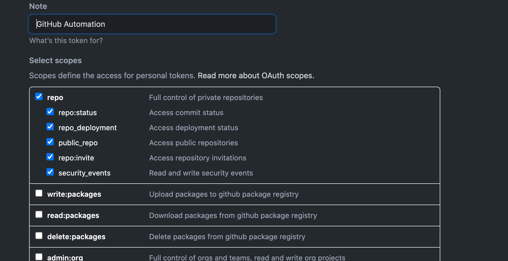
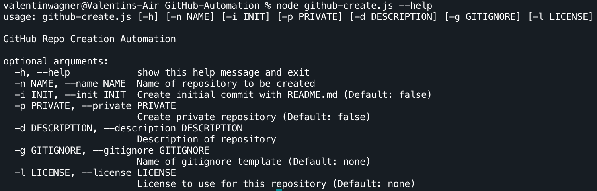

# Automate GitHub Repo Creation with Nodejs
## Installation
1. `git clone git@github.com:ALONELY19XX/Automated-Repository-Creation-Nodejs.git`
2. cd /path/to/repo
3. `npm install`
4. create a [GitHub Acces Token](https://docs.github.com/en/github/authenticating-to-github/creating-a-personal-access-token) (GHAT) and check the following scope(s):

5. Store your generated GHAT in a environment variable `GITHUB_PERSONAL_ACCESS_TOKEN` (use same name!). You can simply create an `.env` file inside the root of the cloned repository and insert `GITHUB_PERSONAL_ACCESS_TOKEN=732462bdfshv8734fhj` (replace 73246bd... with your token)
6. run `node github-create.js -n=REPO_NAME ...`

## Usage

## Example

`node github-create.js -n=REPO_NAME -p=true -d=XYZ -l=mit -i=true -g=nanoc`
